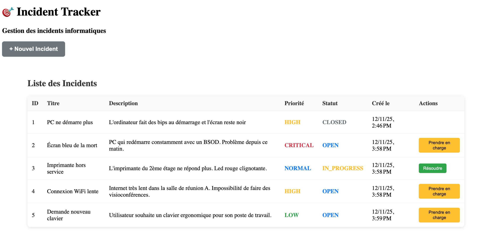
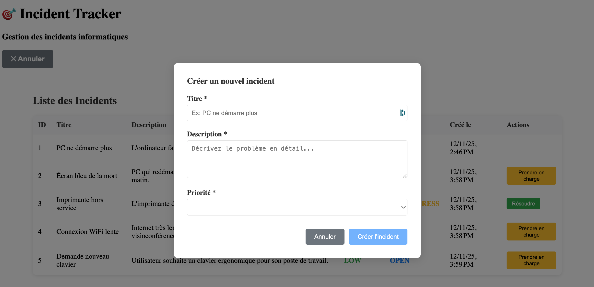

# 🎯 Incident Tracker

Application de gestion d'incidents informatiques développée avec **Spring Boot** et **Angular**.

## 📋 Description

Cette application permet de gérer le cycle de vie complet des incidents informatiques :
- Création d'incidents avec priorités
- Suivi des statuts (Ouvert → En cours → Résolu → Fermé)
- Interface utilisateur moderne et responsive

## 🚀 Technologies utilisées

### Backend
- **Java 21**
- **Spring Boot 3.4**
- **Spring Data JPA**
- **H2 Database** (en mémoire)
- **Maven**

### Frontend  
- **Angular 21**
- **TypeScript**
- **CSS3**
- **Reactive Forms**

## 📸 Aperçu

### Liste des incidents


### Création d'incident


## 🛠️ Installation et lancement

### Prérequis
- Java 21+
- Node.js 20+
- Angular CLI

### Backend (Spring Boot)
```bash
# Cloner le projet
git clone https://github.com/AnhVaccari/incident-tracker.git
cd incident-tracker

# Lancer l'API
./mvnw spring-boot:run
```
L'API sera accessible sur `http://localhost:8080`

### Frontend (Angular)
```bash
# Dans un nouveau terminal
cd frontend
npm install
ng serve
```
L'interface sera accessible sur `http://localhost:4200`

## 📡 API Endpoints

| Méthode | URL | Description |
|---------|-----|-------------|
| GET | `/api/incidents` | Liste tous les incidents |
| GET | `/api/incidents/{id}` | Récupère un incident |
| GET | `/api/incidents/active` | Incidents non fermés |
| POST | `/api/incidents` | Crée un incident |
| PUT | `/api/incidents/{id}/status` | Change le statut |

## 🎯 Fonctionnalités

- ✅ **CRUD complet** des incidents
- ✅ **Workflow de statut** avec boutons contextuels
- ✅ **Validation côté frontend** et backend
- ✅ **Interface responsive** avec codes couleur
- ✅ **Communication temps réel** entre Angular et Spring Boot

## 🎓 Objectifs d'apprentissage

Projet réalisé pour maîtriser :
- Architecture REST avec Spring Boot
- Framework Angular moderne (version 21)
- Communication API frontend/backend
- Gestion d'état et validation de formulaires
- Bonnes pratiques de développement full-stack

